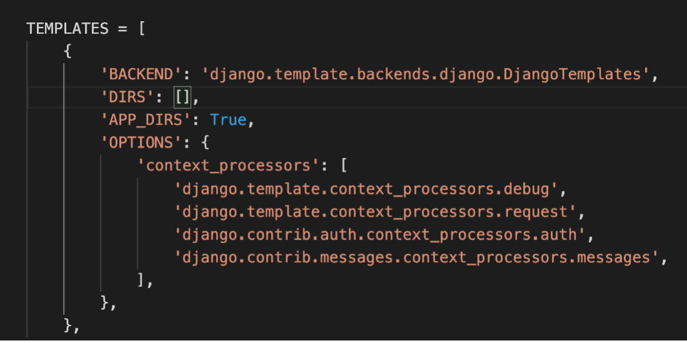
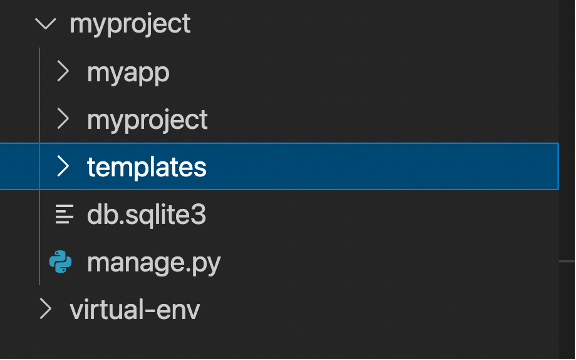
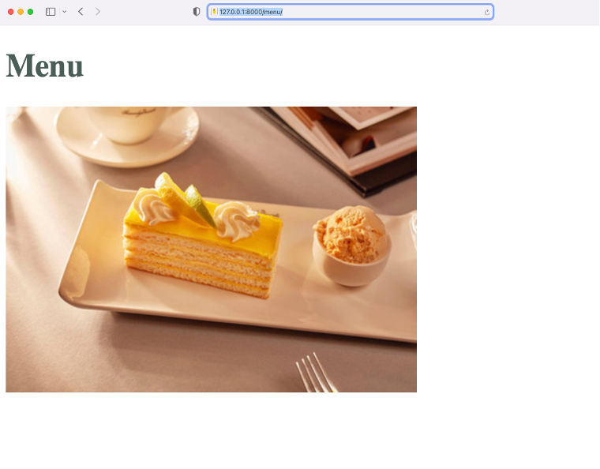

## Creating Templates


### **Goal**

- The learner will practice using Templates in Django

### **Objectives**

- The learner will create views for Menu and About page
- The learner will create respective templates for the two views
- The learner will pass dictionary and other static content such as image inside the webpages created


### **Introduction**

In this lab you will create a template for the Menu and About pages of the Little Lemon website using the functionalities such as ```render()``` function, Dynamic Template Language (DTL) and practice rules for creating templates.

### **Scenario**

The Little Lemon website prototype is progressing well. Now the owners feel it's time to focus on the user interface. They have asked you to re-design the pages ```about``` and ```menu``` using a basic HTML template.

At this point, they do not want to use any advanced HTML or CSS code, as it will be added later.

Your task is to use your existing knowledge of the ```render()``` function, dictionaries, and Django templates to display a basic HTML template in the browser containing some text and images.


### **Learner Instructions**

Initial Lab Instructions:

This lab will require you to modify the following files:

- settings.py
- views.py
- templates/menu.html
- templates/about.html

Additionally, you are required to use the command line console inside the terminal of VS Code.

If not open already, go to ```Terminal``` on the Menu bar at the top of your screen and select ```New Terminal```.

**Note:**

You have already built the project named ```myproject``` and added an app inside the project called ```myapp```.


Follow the instructions below and ensure you check the output at every step and update the necessary files to create different views.

# **Steps**

**Step 1:**

Expand the ```myproject``` folder on the left-hand side menu and open the ```settings.py``` file and set the value of ```DIRS``` option to ```templates```.



**Step 2:**

Open the ```views.py``` file and create two view functions:

- Menu
- About

**Tip:** Make sure to pass the request object as an argument inside both function declarations.

Inside the body of the About function, create a variable called ```about_content``` and assign it to a dictionary with the following key-value pair:
```
{'about': "Little Lemon is a family-owned Mediterranean restaurant, focused on traditional recipes served with a modern twist. The chefs draw inspiration from Italian, Greek, and Turkish culture and have a menu of 12–15 items that they rotate seasonally. The restaurant has a rustic and relaxed atmosphere with moderate prices, making it a popular place for a meal any time of the day."} 
```
**Step 3:**

Add the return statement with the ```render()``` function and pass the following arguments:
```
render(request, 'page.html', {'content':variable\_content})
```

**Tip:** Replace ```page.html``` with the name of the html page you want to render.

**Tip:** In the dictionary replace ```variable_content``` with the name of the variable you created in the view function.

**Tip:** Make sure to import the render function for use
```
from django.shortcuts import render
```

**Step 4:**

Create a folder called ```templates``` at the root project-level directory. 



**Step 5:**
Inside the templates folder, create two files with the following names

- ```menu.html```
- ```about.html```

**Step 6:**
Add the contents of the HTML code provided below to both the ```about.html``` and ```menu.html``` files:
```
<!DOCTYPE html>
<html lang="en">
<head>
<meta charset="UTF-8">
<meta http-equiv="X-UA-Compatible" content="IE=edge">
<meta name="viewport" content="width=device-width, initial-scale=1.0">
<title>Document</title>
</head>
<body>
<!-- Add heading code -->

<!-- Add paragraph code -->

<!-- Add image code -->

</body>
</html>


```

**Step 7:**
Inside the code you just pasted, locate the line with the comment \<!-- Add heading code --\>. Below this line add the following code and replace \<Enter page name\> with the name of the page.

```menu.html``` 
```
<!-- Add heading code -->
<h1 style="color: #495E57"> <Enter page name and remove these surrounding angled brackets> </h1>
```

```about.html```
```
<!-- Add heading code -->
<h1 style="color: #495E57"> <Enter page name and remove these surrounding angled brackets> </h1>
```

**Step 8:**
In the terminal run the command to run the server and launch the browser at the localhost URL.

**Step 9:**
In the browser, navigate to the following URLs:
```
http:127.0.0.1:8000/about
http:127.0.0.1:8000/menu 
```

**Step 10:**
Once you have confirmed that both the URLs display the expected output, open the ```about.html``` page in the templates folder, and add the following code below the HTML comment: <!-- Add paragraph code --\>.

```
<!-- Add paragraph code -->

<p><Enter text> </p>
```

In the code above, replace the contents of ```<Enter text\>``` with a DTL variable to display the dictionary that has ```about``` as the key.

**Tip:** Make sure you have added Django specific syntax ```({ })``` surrounding the key.

**Tip:** Recall the object we have passed to the template and access the variable present inside it.

**Step 11:**
In VS Code, save the ```about.html``` file. In the browser, refresh the ```about.html``` page and check that it displays the contents of the dictionary passed.


**Static files**

The next part of this lab will explore another useful component of Django: Adding static files to the website.

The static image ```dessert.jpg``` that you will use is already added inside the app directory under the ```myapp/static``` folder and you can use it once you configure the settings.

**Step 12:**
Open the 'settings.py' file, and add a declaration for the list called ```STATICFILES_DIRS``` with the following value:

```
'myapp/static',
```
**Tip:** Make sure you add a comma after the string.

**Step 13:**
In the left explorer pane of VS Code inside the myapp folder, expand the ```static``` folder. Expand the ```img``` folder and notice that an image file with the name of ```dessert.jpg``` is present.

Open the ```menu.html``` file and add the following code below \<!-- Add image code --\>
```
<!-- Add image code -->


```

**Tip:** To place an image from the static folder inside a Django template file, make sure to place the following code at the beginning of the HTML file that references the static content.

```

```

**Tip:** To place an image from the static folder inside a Django template file, use the HTML \ tag and inside the ```href=""``` attribute, place the Django `````` and specify the path the image you want to load.



## **Concluding thoughts**

In this lab, you practiced creating a template and updating it with dynamic content.